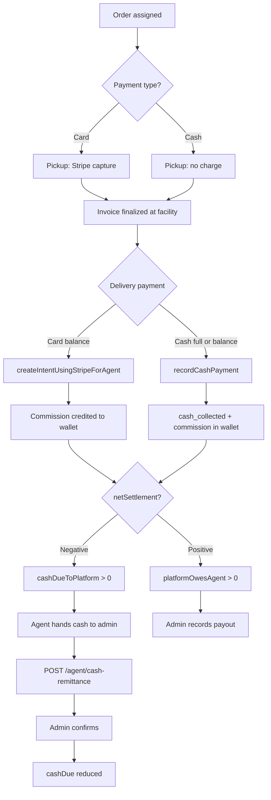

# Agent Earnings & Cash Settlement — Flow & API Guide

Guide for the **Agent mobile app** team: what the agent must do at each order stage, how earnings are calculated, and which APIs to call.

**Base path:** `/agent`  
**Auth:** `Authorization: Bearer <agent_access_token>` on all endpoints below.

---

## 1. Overview

| Order type | Customer pays | Agent collects | Platform settlement |
|------------|---------------|----------------|---------------------|
| **Card** | Stripe (upfront + balance) | Nothing in cash | Platform credits agent **commission** to wallet → admin pays out later |
| **Cash** | Agent at delivery | Full order amount in cash | Agent keeps their share; **owes platform** the rest |
| **Card + cash balance** | Stripe upfront; cash at delivery | Balance amount only | Mixed ledger (see §4) |

Agent wallet tracks:
- **Commission earned** per completed paid order
- **Cash collected** from customers (cash orders)
- **Cash remitted** to admin (settlement)
- **Net balance** → positive = platform owes agent; negative = agent owes platform

---

## 2. How commission is calculated

Set at **invoice finalize** (`billingDetails.agentEarning`).

| Rule | Detail |
|------|--------|
| Commission base | Effective laundry + driver tip |
| Service fee | **Excluded** from commission base |
| Cash orders | Effective laundry = `max(laundry subtotal, zone minimum)` |
| Card orders | Effective laundry = laundry subtotal only |
| Agent % | Zone `agentCommissionPercent` (default ~80%) |

**Example (80% agent, £50 laundry + £5 tip + £5 service fee):**

- Commission base = £55  
- Agent earning = £44  
- Platform share (from laundry+tip) = £11  
- Service fee (£5) goes to platform via order total, not commission split

---

## 3. Order lifecycle — what the agent must do

### 3.1 Card booking

```
Pickup (status → On the Way)
  → Platform captures Stripe auth hold (upfront + service fee + tip)
  → No wallet action yet

Facility → Invoice created & finalized
  → billingDetails.agentEarning saved

Delivery — collect balance
  → Option A: Card balance
       PATCH /agent/booking/:id/balance-payment-method  { balancePaymentMethod: "card" }
       POST  /agent/createIntentUsingStripeForAgent     { bookingId, ... }
  → Option B: Cash balance
       PATCH /agent/booking/:id/balance-payment-method  { balancePaymentMethod: "cash" }
       POST  /agent/recordCashPayment                   { bookingId, amountCollected }

Order fully paid
  → System credits agent wallet (commission)
```

### 3.2 Cash booking

```
Pickup (status → On the Way)
  → No Stripe charge
  → paymentStatus stays pending until delivery

Facility → Invoice created & finalized
  → billingDetails.agentEarning saved

Delivery — collect full amount in cash
  → POST /agent/recordCashPayment { bookingId, amountCollected }

Order fully paid
  → System records:
       cash_collected (debit)  = amount agent received from customer
       booking_commission (credit) = agent earning
  → Net: agent owes platform (total collected − commission)
```

### 3.3 Agent checklist (per order)

| Step | Card | Cash |
|------|------|------|
| 1. Finalize invoice at facility | Required | Required |
| 2. Set balance method (if card booking) | Before delivery charge | N/A (always cash at delivery) |
| 3. Collect payment at delivery | Stripe **or** record cash | **Must** call `recordCashPayment` |
| 4. Verify order shows **Paid** | Yes | Yes |
| 5. Check wallet updated | Optional | Optional |

**Important:** Cash orders **must** use `recordCashPayment`. Do not use Stripe APIs for cash bookings.

---

## 4. Money flow examples

### 4.1 Pure cash — £60 order, £44 agent commission (80%)

```
Customer pays agent £60 cash at delivery
Agent calls recordCashPayment(amountCollected: 60)

Ledger:
  cash_collected     DEBIT  £60
  booking_commission CREDIT £44
  ─────────────────────────────
  Net balance        -£16   → cashDueToPlatform = £16
```

Agent physically keeps £44; must remit £16 to admin.

### 4.2 Pure card — same commission £44

```
Platform collects full amount via Stripe
No cash_collected entry

Ledger:
  booking_commission CREDIT £44
  ─────────────────────────────
  Net balance        +£44   → platformOwesAgent = £44
```

Admin pays agent via payout when processing earnings.

### 4.3 Card upfront + cash balance — £30 upfront, £30 balance, £44 commission

```
Platform already has £30 from card at pickup
Agent collects £30 cash at delivery → recordCashPayment(30)

Ledger:
  cash_collected     DEBIT  £30
  booking_commission CREDIT £44
  ─────────────────────────────
  Net balance        +£14   → platform still owes agent £14
```

---

## 5. Cash settlement — ongoing agent duties

After cash orders, agent balance may be **negative** (owes platform).

### Agent responsibilities

1. **Monitor** `cashDueToPlatform` via wallet/settlement APIs  
2. **Hand cash** to admin (offline / in person)  
3. **Submit remittance** in app → `POST /agent/cash-remittance`  
4. Wait for **admin confirmation** (status: `pending` → `completed`)  
5. Repeat until `cashDueToPlatform` is **0**

Admin can also record cash directly without agent submission (admin panel).

---

## 6. APIs

### 6.1 Record cash at delivery

**`POST /agent/recordCashPayment`**

Use when:
- Full **cash** booking at delivery, or  
- **Card** booking with `balancePaymentMethod = "cash"`

**Request body:**
```json
{
  "bookingId": 1234,
  "amountCollected": 45.50
}
```

| Field | Required | Notes |
|-------|----------|-------|
| `bookingId` | Yes | Booking ID |
| `amountCollected` | Optional* | If sent, must match server `amountDueNow` (±£0.02) |

\*If omitted, server uses full balance due.

**Success response (`data`):**
```json
{
  "bookingId": 1234,
  "paymentType": "cash",
  "balancePaymentMethod": "cash",
  "amountCollected": 45.50,
  "paymentSummary": { "...": "..." }
}
```

**Errors:**
- `"Cash recording is only allowed when balance collection is set to cash"` — set balance method first  
- `"This is a cash booking. Use POST /agent/recordCashPayment instead of Stripe."` — wrong API used  
- `"Amount mismatch. Balance due is X, received Y"` — wrong amount entered

---

### 6.2 Set balance collection method (card bookings only)

**`PATCH /agent/booking/:id/balance-payment-method`**

**Request body:**
```json
{
  "balancePaymentMethod": "cash"
}
```

Values: `"card"` | `"cash"`

Call **before** delivery payment if customer will pay balance in cash.

---

### 6.3 Charge card balance at delivery

**`POST /agent/createIntentUsingStripeForAgent`**

Only for card bookings with `balancePaymentMethod = "card"`.

**Request body:**
```json
{
  "bookingId": 1234,
  "customerId": "cus_xxx",
  "savedPaymentMethodId": "pm_xxx",
  "amount": 30.00
}
```

| Field | Required | Notes |
|-------|----------|-------|
| `bookingId` | Yes | |
| `customerId` | Optional | Falls back to booking's Stripe customer |
| `savedPaymentMethodId` | Optional | Falls back to booking payment method |
| `amount` | Optional | Validated against server `amountDueNow` |

On success, order marked **Paid** and commission credited to wallet.

---

### 6.4 Wallet summary

**`GET /agent/wallet`**

**Response `data`:**
```json
{
  "balance": -16.00,
  "currency": "GBP",
  "netSettlement": -16.00,
  "cashDueToPlatform": 16.00,
  "platformOwesAgent": 0,
  "totalEarning": 440.00,
  "totalEarningCash": 200.00,
  "totalEarningCard": 240.00,
  "totalCashCollected": 300.00,
  "totalCashRemitted": 100.00,
  "pendingCashRemittance": 50.00,
  "totalAdminSettlements": 0,
  "totalPayouts": 0,
  "totalCredited": 440.00,
  "totalDebited": 300.00,
  "commissionCreditCount": 12
}
```

| Field | Meaning for agent UI |
|-------|----------------------|
| `cashDueToPlatform` | **Show prominently** — cash agent must give admin |
| `platformOwesAgent` | Earnings admin will pay (card orders) |
| `netSettlement` | `balance` — overall position |
| `pendingCashRemittance` | Submitted, awaiting admin confirm |
| `totalEarning` | Lifetime commission (all orders) |
| `totalEarningCash` / `totalEarningCard` | Split by payment channel |
| `totalCashCollected` | Total cash taken from customers |
| `totalCashRemitted` | Cash already settled with admin |

---

### 6.5 Settlement summary

**`GET /agent/settlement`**

Same payload as `GET /agent/wallet`. Use either for an **Earnings / Settlement** screen.

---

### 6.6 Wallet transactions (history)

**`GET /agent/wallet/transactions?page=1&limit=20`**

**Query params:**

| Param | Default | Max |
|-------|---------|-----|
| `page` | 1 | — |
| `limit` | 20 | 100 |

**Response `data`:**
```json
{
  "balance": -16.00,
  "currency": "GBP",
  "netSettlement": -16.00,
  "cashDueToPlatform": 16.00,
  "platformOwesAgent": 0,
  "totalEarning": 440.00,
  "transactions": [
    {
      "id": 99,
      "amount": 44.00,
      "currency": "GBP",
      "type": "credit",
      "status": "completed",
      "description": "Commission for order #ORD-123",
      "bookingId": 1234,
      "orderTrackId": "ORD-123",
      "referenceType": "booking_commission",
      "createdAt": "2026-07-10T10:00:00.000Z"
    },
    {
      "id": 98,
      "amount": 60.00,
      "type": "debit",
      "status": "completed",
      "description": "Cash collected for order #ORD-123",
      "referenceType": "cash_collected",
      "bookingId": 1234,
      "orderTrackId": "ORD-123",
      "createdAt": "2026-07-10T09:55:00.000Z"
    }
  ],
  "pagination": {
    "page": 1,
    "limit": 20,
    "total": 45,
    "totalPages": 3,
    "hasNextPage": true,
    "hasPrevPage": false
  }
}
```

**`referenceType` values to display:**

| referenceType | type | Label (suggested) |
|---------------|------|-------------------|
| `booking_commission` | credit | Order commission |
| `cash_collected` | debit | Cash collected from customer |
| `cash_remitted` | credit | Cash paid to admin |
| `admin_settlement` | credit/debit | Admin adjustment |
| `payout` | debit | Earnings payout |

---

### 6.7 Submit cash remittance to admin

**`POST /agent/cash-remittance`**

Call after agent physically hands cash to admin.

**Request body:**
```json
{
  "amount": 50.00,
  "note": "Paid at office on 10 Jul 2026"
}
```

| Field | Required | Notes |
|-------|----------|-------|
| `amount` | Yes | Must be ≤ `cashDueToPlatform - pendingCashRemittance` |
| `note` | No | Shown to admin |

**Success response (`data`):**
```json
{
  "remittanceId": 12,
  "amount": 50.00,
  "status": "pending",
  "currency": "GBP",
  "cashDueToPlatform": 66.00
}
```

Remittance stays **`pending`** until admin confirms in admin panel.  
Only **confirmed** remittances reduce `cashDueToPlatform`.

**Errors:**
- `"No cash balance is available to remit"`
- `"Remittance amount exceeds available cash due (X)"`

---

### 6.8 Earnings dashboard (existing)

**`GET /agent/getEarningReportDashboard`**

Existing performance/earnings charts. Complements wallet APIs but does **not** replace cash settlement fields — use `/wallet` or `/settlement` for cash due.

---

## 7. Suggested agent app screens

### Screen A — Earnings home

- Call: `GET /agent/settlement`
- Show:
  - **Cash due to platform** (red if > 0)
  - **Payable to you** (green if > 0)
  - Total earnings (cash / card split)
  - Button: **Submit cash remittance** (if `cashDueToPlatform > 0`)
  - Link: Transaction history

### Screen B — Transaction history

- Call: `GET /agent/wallet/transactions?page=&limit=`
- Paginated list with `referenceType` labels

### Screen C — Submit remittance

- Form: amount + note
- Call: `POST /agent/cash-remittance`
- Show pending state until admin confirms

### Screen D — Delivery payment (existing flow)

- If cash booking or cash balance → **`recordCashPayment`**
- If card balance → **`createIntentUsingStripeForAgent`**
- Pre-step for card: **`balance-payment-method`** patch if switching to cash

---

## 8. Standard response envelope

All agent APIs use:

```json
{
  "status": "1",
  "message": "Human readable message",
  "data": { }
}
```

Errors:

```json
{
  "status": "0",
  "message": "Validation error or reason"
}
```

HTTP 4xx on validation / not found.

---

## 9. Quick reference — API list

| Method | Endpoint | When to use |
|--------|----------|-------------|
| `POST` | `/agent/recordCashPayment` | Cash collected at delivery |
| `PATCH` | `/agent/booking/:id/balance-payment-method` | Set card/cash for balance |
| `POST` | `/agent/createIntentUsingStripeForAgent` | Charge card balance |
| `GET` | `/agent/wallet` | Wallet & settlement summary |
| `GET` | `/agent/settlement` | Same as wallet summary |
| `GET` | `/agent/wallet/transactions` | Ledger history |
| `POST` | `/agent/cash-remittance` | Report cash paid to admin |
| `GET` | `/agent/getEarningReportDashboard` | Charts / reports |

---

## 10. Agent flow diagram



---

## 11. Roman Urdu summary (agent ke liye)

1. **Card order:** delivery par card se charge karo ya cash record karo — commission wallet mein a jayegi.  
2. **Cash order:** delivery par customer se cash lo aur **`recordCashPayment`** zaroor call karo.  
3. **Earnings screen:** `GET /agent/settlement` — wahan **Cash Due** dikhega jo admin ko dena hai.  
4. **Admin ko cash dene ke baad:** `POST /agent/cash-remittance` se amount submit karo.  
5. **Pending** tab tak rahega jab tak admin confirm na kare.  
6. **Card earnings** admin baad mein payout karega (`platformOwesAgent`).

---

## 12. Related backend files

| Area | Path |
|------|------|
| Wallet service | `services/Agent/agentWalletService.js` |
| Settlement service | `services/Agent/agentSettlementService.js` |
| Cash payment | `controllers/Agent/agents.js` → `recordCashPayment` |
| Agent routes | `routes/agent.js` |
| Commission math | `utils/agentCommission.js` |
| Admin settlement UI | Admin panel → Shop Management → Cash Settlement |

---

*Last updated: July 2026 — matches agent wallet + cash settlement implementation.*
