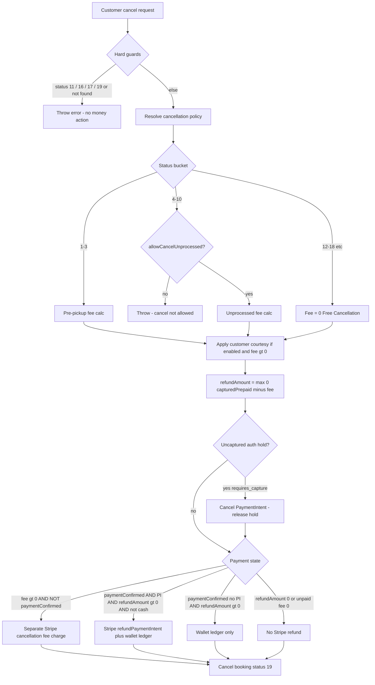

# Cancellation Charge & Refund — Case Matrix + Code Audit

Policy-driven outcomes for **customer** cancel (`POST /customer/cancelBooking` → `CancelBookingService.cancelCustomerBooking`).

Related docs: [CANCELLATION_POLICY.md](./CANCELLATION_POLICY.md), [CANCELLATION_POLICY_SUMMARY.md](./CANCELLATION_POLICY_SUMMARY.md).  
Admin fields: `Laundary Admin/Laundry-service-admin-panel/src/pages/policies-management/CancellationPolicyContent.jsx`.

**Out of scope for this matrix:** agent/admin cancel paths (they do **not** run this fee/refund flow).

---

## 1. Definitions

| Term | Meaning |
|------|---------|
| **Prepaid (captured)** | Amount settled: `upfrontAmount + serviceCharge + tip`. Counted for refund math only when `paymentConfirmed` is true (after status **4** capture). Billing totals still exist earlier for hold amount. |
| **Auth hold** | Manual-capture PaymentIntent created at **booking** for prepaid amount. Status `requires_capture` until On the Way or cancel-release. |
| **Fee base (prepaid bill)** | Same formula as hold: `upfront + serviceFee + tip` via `resolvePrepaidChargedAmount`. Used for **policy % fees** even before capture. **Not** laundry/`booking.orderAmount`. |
| **`booking.orderAmount`** | Services category estimate (often laundry £0). **No longer used for cancel % fees.** |
| **Cancellation charge (fee)** | Policy-calculated amount kept or newly charged (`absolute` and/or `% × fee base`). |
| **Separate cancel charge** | New Stripe `chargeOffSession` with description/type `cancellation_fee` when prepaid was **not** already **captured** (`paymentConfirmed`). |
| **Release hold** | `cancelPaymentIntent` when canceling with uncaptured PI (`requires_capture`). |
| **Stripe refund** | `refundPaymentIntent` on the booking `paymentIntentId` **after capture** for `refundAmount = max(0, prepaid − fee)`. |
| **Wallet ledger** | `wallet` credit row (`customer_refund`); accompany Stripe refund, or alone if paid flag but no PI. |
| **Refund amount** | `max(0, capturedPrepaid − cancellationCharge)`. |

### Status buckets (as coded)

| Bucket | Status IDs | Money / cancel behaviour |
|--------|------------|---------------------------|
| Pre-pickup | `1, 2, 3` | Pre-pickup fee rules; usually unpaid |
| Unprocessed | `4–10` | Unprocessed fee rules; usually prepaid after status 4 |
| Blocked | `11` | Cannot cancel (processing) |
| Blocked | `16, 17` | Cannot cancel (completed) |
| Blocked | `19` | Already cancelled |
| Other | `12–18` (and anything else not above) | Fee forced to **0** — “Free Cancellation” |

### Initial payment timing (context)

- **Booking place (card):** authorization **hold** for prepaid (`upfront + service fee + tip`) via manual-capture PaymentIntent (`requires_capture`). `paymentIntentId` saved; `paymentConfirmed = false`. Customer may see a pending auth in their bank app (not a final settlement).
- **On the Way (status 4):** **capture** the held PaymentIntent → `paymentConfirmed = true`. Legacy bookings without a hold fall back to off-session `chargeOffSession`.
- **Cancel before capture:** **release** hold (`paymentIntents.cancel`); then if policy fee > 0, separate cancellation-fee charge on saved card.
- **Cancel after capture:** same as before — refund `max(0, prepaid − fee)` (no second fee charge).

---

## 2. Decision flowchart

Fee calculation does **not** require Stripe success; cancel still completes if charge/refund/hold-release fails (errors returned in response fields).

---

## 3. Case tables

### Legend (audit status)

| Status | Meaning |
|--------|---------|
| **Handled** | Code implements the intended policy outcome |
| **Partial** | Outcome exists but incomplete, soft-fail, or wrong money base |
| **Not handled** | Policy field / expected behaviour missing in code |

---

### A. Hard blocks

| ID | Case | Expected | Audit | Evidence |
|----|------|----------|-------|----------|
| A1 | Booking not found / wrong customer | Error; no charge/refund | **Handled** | `cancelCustomerBooking` NotFoundError |
| A2 | Status **11** (processing) | Cannot cancel | **Handled** | ValidationError |
| A3 | Status **19** (already cancelled) | Conflict | **Handled** | ConflictError |
| A4 | Status **16** or **17** (completed) | Cannot cancel | **Handled** | ValidationError |

---

### B. Pre-pickup fee calculation (status 1–3)

Order of checks in `calculatePrePickupCharge`: free window → first-cancel leniency → absolute / %.

| ID | Case | Expected fee | Audit | Evidence |
|----|------|--------------|-------|----------|
| B1 | `prePickupFreeChargeWindowMinutes > 0` and minutes until collection **>** window | Fee **0** | **Handled** | Free window return |
| B2 | Free window minutes **= 0** | No time-based free cancel | **Handled** | `freeWindowMinutes > 0` required |
| B3 | Inside free window (minutes until pickup ≤ window) | Continue to leniency / fee | **Handled** | Falls through |
| B4 | `prePickupFirstCancellationLeniency` on + first cancel ever | Fee **0** | **Handled** | `isFirstCancellation` |
| B5 | First-leniency on + not first cancel | Continue to fee | **Handled** | | 
| B6 | `prePickupAbsoluteAmount` set (truthy) | Flat fee at least that amount | **Handled** | Parsed absolute |
| B7 | `prePickupPercentage` set + fee base > 0 | `% × prepaid` (upfront+fee+tip); final = `max(absolute, %)` | **Handled** | Uses `percentageBase` / `resolvePrepaidChargedAmount` |
| B8 | Percentage set but prepaid bill is **0** | **No % fee** (absolute may still apply) | **Handled** | `base > 0` required |
| B9 | Both absolute and percentage | `max(absolute, percentage of prepaid)` | **Handled** | |
| B10 | Absolute and % both 0 / empty | Fee **0** | **Handled** | |
| B11 | Fee % on laundry / `orderAmount` | Old behaviour | **Not used** | % fees intentionally use prepaid bill now |
| B12 | `prePickupAbsoluteCurrency` | Used in messages / response currency | **Partial** | Used for currency string; Stripe chargeOffSession currency is effectively GBP elsewhere |

---

### C. Unprocessed fee calculation (status 4–10)

| ID | Case | Expected | Audit | Evidence |
|----|------|----------|-------|----------|
| C1 | `allowCancelUnprocessed = false` | Cancel rejected | **Handled** | ValidationError |
| C2 | `allowCancelUnprocessed = true` | Cancel allowed; fee calculated | **Handled** | |
| C3 | `unprocessedAbsoluteAmount` set | Flat fee | **Handled** | `calculateUnprocessedCharge` |
| C4 | `unprocessedOrderValuePercentage` + fee base > 0 | `% × prepaid`; `max` with absolute | **Handled** | Canonical field |
| C5 | `unprocessedOrderValuePercentage` + prepaid bill **0** | No % fee | **Handled** | `base > 0` required |
| C6 | Fee % on laundry / `orderAmount` | Old behaviour | **Not used** | % fees use prepaid bill now |
| C7 | Admin field `unprocessedPercentage` only (legacy) | Same as order-value % when OV% empty | **Handled** | Fallback in `calculateUnprocessedCharge` |
| C7b | Admin edits unprocessed % | Single form field → saves both columns equal | **Handled** | Admin payload sync |
| C8 | Admin field `unprocessedAfterPickupMinutes` | Time gate after pickup | **Not handled** | **Never read** |
| C9 | First-cancel / free-window on unprocessed | Same as pre-pickup | **Not handled** | Those checks are pre-pickup only (by design in code) |

---

### D. Customer courtesy leniency (any phase after fee > 0)

| ID | Case | Expected | Audit | Evidence |
|----|------|----------|-------|----------|
| D1 | `customerLeniencyEnabled = false` | No cap | **Handled** | Gate on enabled |
| D2 | Enabled + recent cancels **<** `courtesyCount` | Fee = `min(fee, courtesyCapAmount)` | **Handled** | `applyCustomerLeniency` |
| D3 | Enabled + recent cancels **≥** `courtesyCount` | Full fee | **Handled** | `applied: false` |
| D4 | `courtesyCapAmount = 0` while in courtesy slots | Fee becomes **0** | **Handled** (surprising but coded) | `Math.min(charge, 0)` |
| D5 | Count window uses cancellation time | Count cancels in window by cancel date | **Partial** | Filter uses `booking.createdAt` in include where, not cancel time |

---

### E. Money outcomes (Stripe / wallet)

Assumes fee already calculated as `cancellationCharge` and `refundAmount = max(0, prepaid − fee)` (if prepaid 0, `totalPaid` falls back to `orderAmount` for refund math only).

| ID | Case | Preconditions | Expected money action | Audit | Evidence |
|----|------|---------------|----------------------|-------|----------|
| E1 | Unpaid + fee **0** | Status 1–3; waived or 0 policy | No separate charge; no Stripe refund | **Handled** | `shouldChargeCancelFeeSeparately` false; refund needs `paymentConfirmed` |
| E1b | Auth hold + fee **0** (pre-capture cancel) | PI `requires_capture`; `paymentConfirmed=false` | **Release hold**; no fee charge; no refund | **Handled** | `cancelPaymentIntent` then skip charge |
| E2 | Hold-only / unpaid + fee **> 0** + card on file | Not `paymentConfirmed`; PM + Stripe customer | Release hold if any; then separate **Cancellation fee** charge | **Handled** | release then `chargeOffSession` |
| E3 | Unpaid + fee **> 0** + cash/card missing | No PM or no Stripe customer | Fee in response; charge skipped/fails; **cancel still succeeds** | **Partial** | Soft-fail; `stripeChargeError` set |
| E4 | Unpaid + fee **> 0** + Stripe charge throws | Card decline etc. | Cancel still succeeds; error logged | **Partial** | catch does not block |
| E5 | Paid (confirmed + PI) + fee **0** + `refundAmount = prepaid` | Card; not cash | **Full** Stripe refund of prepaid | **Handled** | `processRefund` → `refundPaymentIntent` |
| E6 | Paid + fee **<** prepaid |  | **Partial** Stripe refund = prepaid − fee; no second fee charge | **Handled** | Skip separate charge; refund > 0 |
| E7 | Paid + fee **≥** prepaid | Fee > prepaid | `refundAmount = 0`; **remaining** fee charged off-session (`fee − prepaid`); prepaid retained on original PI | **Handled** | Separate charge for shortfall |
| E7b | Paid + fee **≥** prepaid | Fee = prepaid | `refundAmount = 0`; no second charge | **Handled** | Fee retained by not refunding |
| E8 | Paid confirmed + refundAmount > 0 + **no** `paymentIntentId` |  | Wallet ledger only (no Stripe refund) | **Handled** | `processWalletRefundOnly` |
| E9 | `paymentType = cash` + refundAmount > 0 + PI exists |  | Stripe refund branch **skipped** | **Handled** | cash excluded from PI refund if |
| E10 | Cash unpaid | Fee > 0 | Separate charge needs PM; usually soft-fail | **Partial** | Same as E3 |
| E11 | Stripe refund throws | Paid path | Cancel still succeeds; `stripeRefundError` | **Partial** | Soft-fail after status update |
| E12 | Wallet create fails after Stripe refund |  | Stripe refund already done; ledger warning | **Partial** | try/catch around wallet |
| E13 | Already fully refunded PI |  | `alreadyRefunded` response; no double wallet credit | **Handled** | `refundPaymentIntent` + `processRefund` early return |
| E14 | Agent/admin cancel | Their APIs | Same policy charge/refund | **Not handled** | Agent cancel status-only; no this service |
| E15 | Auth hold release fails | Pre-capture cancel | Cancel still succeeds; `authHoldReleaseError` | **Partial** | Soft-fail |
| E16 | Booking-time auth hold | Card createBooking | Manual-capture PI; bank may show pending auth | **Handled** | `createAuthorizationHold` |
| E17 | On the Way capture | Status 4 + held PI | Capture hold → `paymentConfirmed` | **Handled** | `capturePaymentIntent` (+ legacy charge fallback) |

**Ops note:** Deploy/restart required for auth-hold + `refundPaymentIntent` paths on production.

---

### F. Status “other” bucket

| ID | Case | Expected (product) | Audit | Evidence |
|----|------|--------------------|-------|----------|
| F1 | Status **12–18** (e.g. delivery / hold depending on mapping) | Likely restricted or phase fees | **Partial / likely unintended** | Code sets fee **0** “Free Cancellation” |
| F2 | Config `isActive` on `cancellation_policy_configs` | Inactive config ignored | **Not handled** | Cancel path does not check `config.isActive` |

---

## 4. Policy field coverage appendix

| Field | Used for fee? | Used for refund? | Audit |
|-------|---------------|------------------|-------|
| `prePickupAbsoluteCurrency` | Currency label | Response currency | **Partial** (Stripe hardcodes GBP in charge helper) |
| `prePickupAbsoluteAmount` | Yes (pre-pickup) | Indirect (reduces refund) | **Handled** |
| `prePickupPercentage` | Yes (`% × orderAmount`) | Indirect | **Handled** |
| `prePickupFreeChargeWindowMinutes` | Yes (minutes until pickup) | — | **Handled** |
| `prePickupFirstCancellationLeniency` | Yes (pre-pickup only) | — | **Handled** |
| `unprocessedAbsoluteCurrency` | Currency label | Response currency | **Partial** |
| `unprocessedAbsoluteAmount` | Yes (unprocessed) | Indirect | **Handled** |
| `unprocessedPercentage` | Legacy / mirrored | — | **Handled as fallback** (prefer OV%) |
| `unprocessedAfterPickupMinutes` | **No** (legacy UI kept) | — | **Not handled** in fee calc |
| `unprocessedOrderValuePercentage` | Yes (`% × prepaid`) | Indirect | **Handled** (canonical) |
| `allowCancelUnprocessed` | Gate cancel | — | **Handled** |
| `courtesyWindowDays` | Leniency lookback | — | **Partial** (uses booking.createdAt) |
| `courtesyCapAmount` | Cap fee | Indirect | **Handled** |
| `courtesyCount` | Max courtesy cancels | — | **Handled** |
| `customerLeniencyEnabled` | Gate courtesy | — | **Handled** |
| `isActive` (config row) | — | — | **Not handled** at cancel time |

---

## 5. Example scenarios (numbers)

Assume policy: pre-pickup 50% of `orderAmount`, unprocessed 50% of `orderAmount`, first-leniency off, free window 0. Prepaid billing = £22.19.

| Scenario | Status | Prepaid bill | Policy % | Fee | Auth / paid | Money action |
|----------|--------|--------------|----------|-----|-------------|--------------|
| Place (card) | 1 | £22.19 | — | — | Hold £22.19 | Bank may show pending auth |
| Place then cancel | 1–3 | £22.19 | 0% / waived | £0 | Hold released | Release hold; no fee |
| Place then cancel | 1–3 | £22.19 | 50% | **£11.095 → £11.10** | Hold released | Release hold + cancel fee charge ≈ **£11.10** |
| Place then cancel | 1–3 | £22.19 | 100% | **£22.19** | Hold released | Release hold + cancel fee **£22.19** |
| After On the Way | 4–10 | £22.19 | 0% | £0 | Captured | **Full £22.19** refund |
| After On the Way | 4–10 | £22.19 | 50% | £11.10 | Captured | Refund ≈ **£11.09** |
| After On the Way | 4–10 | £22.19 | 100% | £22.19 | Captured | Refund **£0** (fee keeps prepaid) |

---

## 6. Gaps to fix later (follow-up — not part of this doc task)

1. ~~Wire or remove unused **`unprocessedPercentage`**~~ — **Done:** single admin field (`unprocessedOrderValuePercentage`); save mirrors to legacy column; cancel calc prefers OV% then falls back to legacy %.
2. `unprocessedAfterPickupMinutes` still unused in fee logic (admin labelled legacy).
3. Revisit statuses **12–18** free-cancel branch — likely unintended.
4. Fail-hard vs soft-fail when separate cancel fee charge, refund, or **hold release** fails (today cancel always proceeds).
5. Align Stripe charge **currency** with policy currency fields.
6. Courtesy counting by **cancellation** date, not booking `createdAt`.
7. Respect **`cancellation_policy_configs.isActive`** (or drop the field).
8. Extend policy money flow to **agent/admin** cancel if product requires it.
9. Confirm **production deploy** of auth-hold + Stripe refund paths (ops).
10. Auth holds expire (Stripe typically ~7 days for cards) — long-lead bookings before On the Way may need re-auth if hold expires.
11. Booking create that fails after DB insert is marked status **19**; consider harder cleanup (history/cancel row) if product needs it.
---

## 7. Coverage summary

| Area | Handled | Partial | Not handled |
|------|---------|---------|-------------|
| Hard blocks A | 4 | 0 | 0 |
| Pre-pickup fee B | 9 | 1 | 1 |
| Unprocessed fee C | 5 | 0 | 4 |
| Courtesy D | 4 | 1 | 0 |
| Money E (incl. auth hold) | 11 | 6 | 1 |
| Other F | 0 | 1 | 1 |

**Bottom line:** Card bookings place an **authorization hold at booking**, **capture at On the Way**, and **release hold on pre-capture cancel** (then optional separate cancel fee). Cancel **% fees use prepaid (upfront + service fee + tip)**, not laundry/`orderAmount`. Post-capture cancel refunds `prepaid − fee`. Remaining gaps: unused policy fields and soft-fail money errors.
